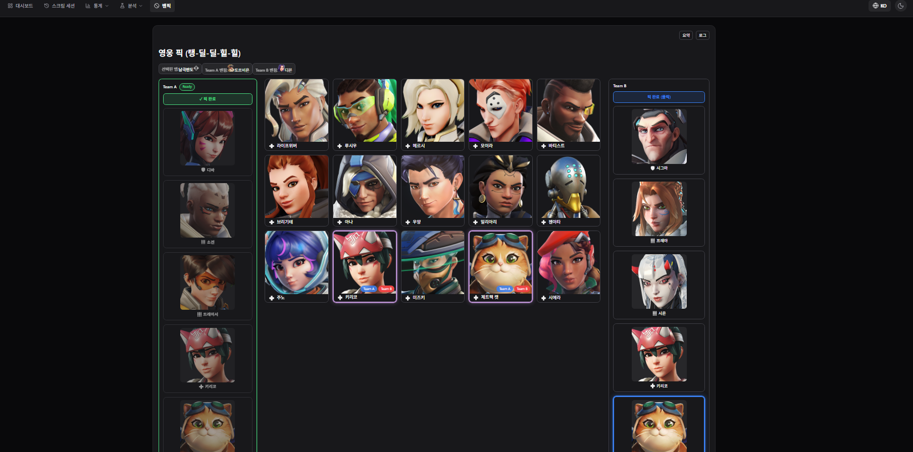
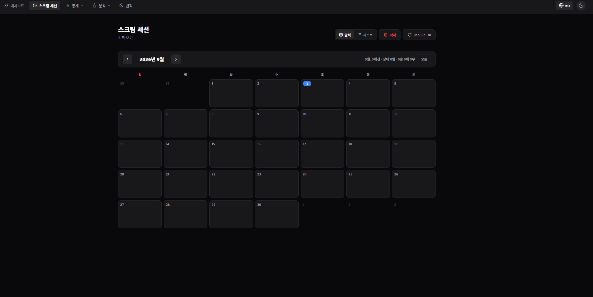
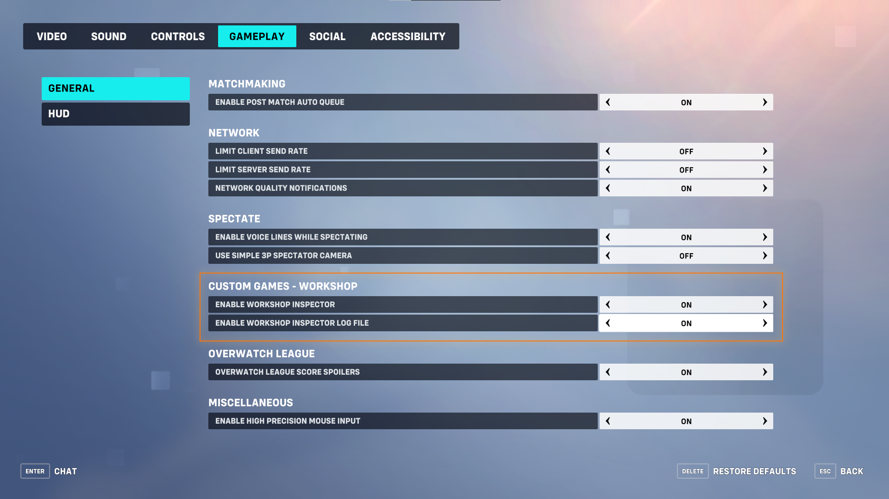

# Scrim Analyzer

Overwatch scrim analysis toolkit — turn raw Workshop match logs into fight-level
win-rate analytics, ultimate economy breakdowns, per-player stats, and a
real-time draft (ban/pick) board with head-to-head rooms.

오버워치 스크림 분석 도구입니다. 워크숍 매치 로그를 업로드하면 한타 단위 승률 분석,
궁극기 이코노미, 선수별 통계, 그리고 실시간 밴픽(대전) 보드까지 제공합니다.

> **English / 한국어** — This README is bilingual. The app UI supports both
> languages via a toggle. 앱 UI는 언어 토글로 한/영을 모두 지원합니다.

---

## Screenshots / 스크린샷

**Ban/pick duel — real-time draft between two teams (server-authoritative).**
**밴픽 대전 — 두 팀 간 실시간 드래프트 (서버 권위 검증).**



**Scrim session calendar — browse and manage uploaded sessions by date.**
**스크림 세션 달력 — 업로드한 세션을 날짜별로 관리.**



**Overview, map analysis, and ultimate analysis** — win rates by map and map type,
per-player averages, situational ultimate win rates, and exchange patterns.
**전체 통계·맵 분석·궁극기 분석** — 맵·맵 타입별 승률, 선수 평균 지표, 상황별 궁극기 승률·교환 패턴.

> ℹ️ Screenshots for these three views are pending — they will be re-captured from
> synthetic sample data and added here later. (Earlier captures were removed because
> they showed real aggregate results.)
> ℹ️ 위 세 화면의 스크린샷은 합성 샘플 데이터 기반으로 다시 촬영해 추후 추가할 예정입니다
> (기존 캡처는 실제 집계 결과가 노출되어 제거했습니다).

---

## Features / 주요 기능

- **Fight analysis / 한타 분석** — per-fight win rates by situation, across time
  windows (period A vs. B), from either team's perspective.
- **Ultimate analysis / 궁극기 분석** — combos & sequences, exchange patterns,
  counter (response) playbook, and initiation quality.
- **Map analysis / 맵 분석** — strength by map and map type, weekly trend matrix.
- **Player stats / 선수 통계** — per-player overview, hero pools, recent K/D form,
  and head-to-head player comparison.
- **First fight / 첫 한타** — first kill / first death breakdowns.
- **Ban/pick draft / 밴픽 대전** — a local hot-seat draft board **plus real-time
  online rooms** over WebSocket with server-authoritative rule validation.

---

## Tech stack / 기술 스택

- **Backend**: FastAPI · SQLAlchemy 2.0 (async) · Alembic · SQLite (aiosqlite)
- **Frontend**: React · Vite · Recharts · lucide-react
- **Realtime**: WebSocket (ban/pick rooms)
- **Deploy**: uvicorn + nginx (Docker Compose provided)

---

## Configuration / 설정

Branding and your "base team" (the team highlighted as *us*) live in two places:

브랜딩과 "기준 팀"(우리 팀으로 강조 표시할 팀)은 두 곳에서 설정합니다:

| What | Where | Default |
|------|-------|---------|
| App name / 앱 이름 | `frontend/src/config.js` → `APP_NAME` | `"Scrim Analyzer"` |
| Base team / 기준 팀 (frontend) | `frontend/src/config.js` → `BASE_TEAM` | `"Team A"` |
| Base team / 기준 팀 (backend) | env var `BASE_TEAM` | `"Team A"` |

Keep the frontend `BASE_TEAM` and backend `BASE_TEAM` env var in sync.
프론트 `BASE_TEAM` 과 백엔드 `BASE_TEAM` 환경변수를 동일하게 맞추세요.

---

## Local development / 로컬 개발

### Backend

```bash
cd backend
python -m venv venv

# Windows
.\venv\Scripts\Activate.ps1
# macOS / Linux
# source venv/bin/activate

pip install -r requirements.txt

# Optional: set your team name (defaults to "Team A")
# Windows PowerShell:  $env:BASE_TEAM = "Team A"
# macOS / Linux:       export BASE_TEAM="Team A"

# Run (the SQLite DB is created automatically on first start)
python -m uvicorn main:app --reload --port 8000
```

The database file `backend/data/scrim.db` and the upload directory
`backend/scrim_rowdata_log/` are created automatically and start empty.
DB 파일과 업로드 폴더는 최초 실행 시 자동 생성되며 빈 상태로 시작합니다.

### Frontend

```bash
cd frontend
npm install
npm run dev        # http://localhost:5173  (proxies /api and /ws to :8000)
```

Vite dev server proxies `/api` and `/ws` to the backend on port 8000, so run the
backend first. Vite 개발 서버가 `/api`·`/ws` 를 8000 포트 백엔드로 프록시하므로
백엔드를 먼저 실행하세요.

---

## Production deploy / 배포 (nginx + Docker)

A `docker-compose.yml` builds both services. nginx serves the built frontend and
reverse-proxies `/api` (and `/ws`) to uvicorn.

`docker-compose.yml` 로 두 서비스를 빌드합니다. nginx 가 빌드된 프론트를 서빙하고
`/api`·`/ws` 를 uvicorn 으로 리버스 프록시합니다.

Docker 없이 저사양 서버(1GB RAM)에 venv+pm2+nginx 로 배포하려면 [docs/DEPLOY.md](docs/DEPLOY.md) 참조.

```bash
docker compose up --build
# frontend on :80, backend on :8000
```

`frontend/nginx.conf` contains the reverse-proxy config. To change the base team
in production, set the `BASE_TEAM` environment variable on the backend service.
프로덕션에서 기준 팀은 백엔드 서비스의 `BASE_TEAM` 환경변수로 지정합니다.

---

## Preparing logs / 로그 준비

The analyzer ingests CSV-style text logs produced by an **Overwatch Workshop**
scrim-logging mode. Each match (map) becomes one `.txt` file of timestamped events
(`hero_spawn`, `ultimate_start`, eliminations, `player_stat`, …). Team slots are
positional (`1팀` / `2팀`); the actual team names are entered when you register the
scrim in the app.

이 분석기는 **오버워치 워크숍** 스크림 로깅 모드가 출력하는 CSV 형식 텍스트 로그를
사용합니다. 맵 하나당 `.txt` 파일 하나가 생성되며, 팀은 위치 기준(`1팀`/`2팀`)이고 실제
팀 이름은 앱에서 스크림 등록 시 입력합니다.

**Just want to try the app?** Skip to the [included sample](#try-it-now--바로-체험)
below — no logs of your own required.
**앱만 먼저 체험하고 싶다면** 아래 [샘플](#try-it-now--바로-체험)로 건너뛰세요 — 자신의
로그가 없어도 됩니다.

### 1. Generate logs (ScrimTime Workshop) / 로그 생성

Logs are produced by Caldoran's **ScrimTime** Workshop mode.
로그는 Caldoran의 **ScrimTime** 워크숍 모드로 생성합니다.

- Workshop code / 워크숍 코드: **`DKEEH`** — https://workshop.codes/DKEEH
- Full event/field reference / 이벤트·필드 전체 문서: see the Google Sheet linked
  from the workshop page above / 위 워크숍 페이지에 연결된 구글 시트 참고.

### 2. Game settings (required) / 게임 설정 (필수)

By default Overwatch does **not** write the inspector log to a file. Enable it in
the client settings:

기본값으로 오버워치는 인스펙터 로그를 파일로 저장하지 **않습니다**. 클라이언트 설정에서
활성화하세요:

- **Settings → Gameplay → General → "Custom Games - Workshop"** section
  (설정 → 게임플레이 → 일반 → **커스텀 게임 - 워크샵** 섹션)
- **Enable Workshop Inspector / 워크샵 인스펙터 활성화** = **ON**
- **Enable Workshop Inspector Log File / 워크샵 인스펙터 로그 파일 활성화** = **ON**
- Both are **off by default** / 두 옵션 모두 기본 비활성화 상태입니다.



Log file location (Windows) / 로그 파일 저장 위치 (Windows):
`Documents\Overwatch\Workshop\`

### 3. Event selection / 이벤트 선택 주의

- Damage / healing / ability-use events are **off by default** in ScrimTime because
  they are server-heavy. The core features of this analyzer (fights, ultimates,
  first-kill/death) work with the **default events only** — you don't need to enable
  them. / 스킬 사용·피해량·회복량 이벤트는 서버 부하가 커서 ScrimTime 기본값이 비활성화
  입니다. 이 분석기의 핵심 기능(한타·궁극기·킬데스)은 **기본 이벤트만으로** 동작합니다.
- Enabling damage/healing/ability events makes logs 3–5× larger; the parser simply
  **skips** them, so it's harmless (reserved for future features). / 해당 이벤트를
  켜면 로그가 3~5배 커지지만 파서가 조용히 **스킵**하므로 문제없습니다(향후 확장용).

### 4. Log language / 로그 언어

- The analyzer expects **Korean-client** logs. / 분석기는 **한국어 클라이언트** 로그
  기준으로 동작합니다.
- **English-client** logs must be converted to the Korean format first, using
  `backend/log_normalizer.py`, then uploaded. / **영어 클라이언트** 로그는 먼저
  `backend/log_normalizer.py`로 한국어 형식으로 변환한 뒤 업로드하세요.

  ```bash
  # <input> may be a single file or a folder; <output_dir> receives the converted logs
  # <입력>은 파일 또는 폴더, <출력폴더>에 변환된 로그가 저장됩니다
  cd backend
  python log_normalizer.py ./raw_en_logs ./converted_logs
  # single file / 단일 파일:
  # python log_normalizer.py Log-2026-01-01.txt ./converted_logs
  ```

  > ⚠️ This is a current limitation — see [Known limitations](#known-limitations--알려진-한계).
  > ⚠️ 이는 현재의 한계입니다 — [알려진 한계](#known-limitations--알려진-한계) 참고.

### Try it now / 바로 체험

**Try the app end-to-end with the included sample** — no logs of your own required:
포함된 샘플로 앱을 처음부터 끝까지 체험할 수 있습니다:

➡️ See [`sample_data/`](sample_data/) for an anonymized one-map log and
step-by-step upload instructions.
익명화된 한 맵 로그와 업로드 방법은 [`sample_data/`](sample_data/) 를 참고하세요.

Upload flow / 업로드 흐름:
1. Register a scrim session (name, team names, maps).
   스크림 세션 등록 (세션명, 팀 이름, 맵).
2. Upload the per-map `.txt` log(s) to that session.
   해당 세션에 맵별 `.txt` 로그를 업로드.
3. Open the session to see the analysis tabs populate.
   세션을 열면 분석 탭이 채워집니다.

### Related tools / 다른 파서 생태계

Other tools that process the same ScrimTime logs: **Datastrike**,
**Parsertime** (lux), and the **ScrimTime parser** (surfs). This project is a
team-oriented alternative focused on **scrim analysis and ban/pick practice**.

같은 ScrimTime 로그를 처리하는 다른 도구들: **Datastrike**, **Parsertime**(lux),
**ScrimTime 파서**(surfs). 본 프로젝트는 **팀 스크림 분석·밴픽 연습**에 특화된 대안입니다.

---

## Project structure / 프로젝트 구조

```
ow-scrim-analyzer/
├── backend/
│   ├── main.py            # FastAPI app + all analysis endpoints
│   ├── db/                # SQLAlchemy models & async engine
│   ├── services/          # fight_analysis (fight grouping / metrics)
│   ├── banpick/           # ban/pick rooms (WebSocket, server-authoritative)
│   ├── alembic/           # DB migrations
│   ├── log_normalizer.py  # raw Workshop log → normalized events
│   └── requirements.txt
├── frontend/
│   ├── src/
│   │   ├── config.js      # APP_NAME + BASE_TEAM  ← edit to rebrand
│   │   ├── App.jsx        # shell, navigation, upload
│   │   ├── *Stats.jsx     # analysis tabs
│   │   └── banpick/       # ban/pick UI
│   ├── public/            # game assets (see "Asset copyright")
│   └── nginx.conf
├── sample_data/           # anonymized sample log + how-to
└── docker-compose.yml
```

---

## Asset copyright / 에셋 저작권

The hero portraits, map images, role icons, and other Overwatch imagery under
`frontend/public/` are **© Blizzard Entertainment, Inc.** They are **not** covered
by this project's MIT license. This is a **non-commercial fan project** and these
assets are used in accordance with Blizzard's fan-content / IP usage policy. All
Overwatch trademarks and copyrights belong to Blizzard Entertainment. This project
is not affiliated with or endorsed by Blizzard Entertainment.

`frontend/public/` 아래의 영웅 초상화·맵 이미지·역할 아이콘 등 오버워치 관련 이미지는
**© Blizzard Entertainment, Inc.** 의 저작물이며 본 프로젝트의 MIT 라이선스 적용 대상이
**아닙니다**. 본 프로젝트는 **비상업적 팬 프로젝트**로, 해당 이미지는 블리자드의 팬 콘텐츠
정책에 따라 사용됩니다. 오버워치의 모든 상표와 저작권은 Blizzard Entertainment 에 있으며,
본 프로젝트는 블리자드와 제휴하거나 블리자드의 승인을 받은 것이 아닙니다.

If you redistribute or deploy this project publicly, review Blizzard's current
fan-content policy and consider replacing these assets with your own.
공개 재배포·배포 시 블리자드의 최신 팬 콘텐츠 정책을 확인하고, 필요하면 에셋을 자체
제작물로 교체하세요.

---

## Known limitations / 알려진 한계

- **Korean-client logs only.** The parser targets Korean Overwatch-client logs.
  English logs work only after conversion via `backend/log_normalizer.py`
  (see [Log language](#4-log-language--로그-언어)). / **한국어 클라이언트 로그 전용.**
  영어 로그는 `backend/log_normalizer.py` 변환을 거쳐야만 동작합니다.
- **ScrimTime log format only.** Input must come from the ScrimTime Workshop mode
  (code `DKEEH`); other logging formats are not supported. / 입력은 ScrimTime
  워크숍(코드 `DKEEH`) 형식이어야 하며, 다른 로그 형식은 지원하지 않습니다.
- **Push maps need manual result correction.** Push logs carry no score events, so
  auto-detected results default to a draw and can be corrected in the app. / 밀기맵
  로그에는 스코어 이벤트가 없어 자동 판정이 무승부로 저장되며, 앱에서 수기 보정합니다.

## Roadmap / 로드맵

- [ ] **Native English-log support** (parse English-client logs directly, without
  the normalizer step). / **영어 로그 직접 지원** (정규화 단계 없이 영어 클라이언트
  로그를 그대로 파싱).
- [x] Screenshots (ban/pick, session calendar, workshop settings, overview, map,
  ultimate). / 스크린샷 추가 (밴픽·세션 달력·워크숍 설정·전체·맵·궁극기).
- [ ] A short demo / walkthrough video. / 짧은 데모·워크스루 영상.

---

## Contributing / 기여

Contributions are welcome! 기여를 환영합니다.

1. Open an issue to discuss substantial changes first.
   큰 변경은 먼저 이슈로 논의해 주세요.
2. Fork → feature branch → PR. Keep PRs focused.
   포크 → 기능 브랜치 → PR. PR은 한 가지 주제로.
3. **Never commit real team data.** Logs, databases, and dumps are ignored by
   `.gitignore` by design — only anonymized samples under `sample_data/` are
   allowed. 실제 팀 데이터를 커밋하지 마세요. 로그·DB·덤프는 `.gitignore` 로 차단되며,
   `sample_data/` 의 익명 샘플만 허용됩니다.
4. Backend tests: `cd backend && python -m pytest banpick/test_state.py`.

---

## License / 라이선스

MIT (source code only) — see [LICENSE](LICENSE). Game assets are excluded; see
**Asset copyright** above. 소스 코드는 MIT, 게임 에셋은 제외 — 위 **에셋 저작권** 참고.
